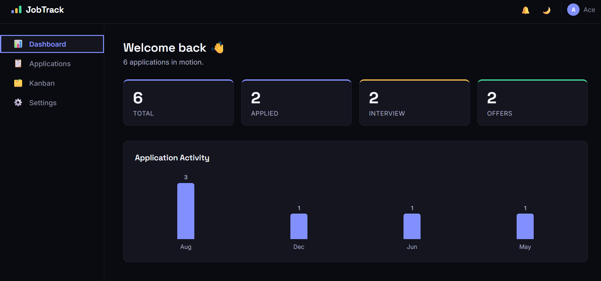

# JobTrack Web Application

A Kanban-style dashboard for tracking internship and job applications — built from scratch with React to practice component design, routing, state management, and Context, and to have a real, working portfolio project rather than another to-do list clone.

> Built by [Aish Maskey](https://github.com/aishmaskey23-ace) as a self-directed learning project while studying frontend development.

## About

Job hunting means juggling dozens of applications across spreadsheets, emails, and sticky notes. JobTrack pulls all of that into one place: add an application once, then track it through Applied → Interview → Offer / Rejected, with a dashboard summarizing where things stand and a Kanban board for a faster visual overview.

Everything is stored in the browser via `localStorage` — no backend, no sign-up, your data never leaves your machine.

## Features

- **Dashboard** — at-a-glance stats (total, applied, interview, offers) and a monthly activity chart, both computed live from your data
- **Applications list** — full CRUD (add, view, edit, delete), with search by company, filter by status, and five sort options
- **Kanban board** — drag and drop applications between status columns
- **Application details** — a dedicated page per application with a shareable URL (`/applications/:id`)
- **Persistent storage** — everything survives a page refresh via `localStorage`
- **Dark mode** — toggleable from the navbar or Settings, persisted across sessions
- **Responsive** — collapsible sidebar and stacking layouts down to mobile widths
- **Accessible** — semantic landmarks, labeled icon buttons, visible focus states, `aria-live` form errors, and a keyboard-dismissible (Escape) modal

## Tech Stack

- **React 19** — components, hooks, Context API
- **React Router v7** — client-side routing, nested layouts, dynamic segments
- **Vite** — build tooling and dev server
- **Plain CSS** — a small custom design-token system (`src/styles/tokens.css`), no UI framework
- **`localStorage`** — the only persistence layer; no backend

## Screenshots



_Add screenshots here once the app is deployed — a Dashboard view, the Applications list, and the Kanban board make the strongest first impression._

```
screenshots/
├── dashboard.png
├── applications.png
└── kanban.png
```

## Installation

```bash
git clone https://github.com/<your-username>/jobtrack.git
cd jobtrack
npm install
npm run dev
```

Then open the local URL Vite prints (typically `http://localhost:5173`).

To build for production:

```bash
npm run build
npm run preview
```

## Project Structure

```
src/
├── components/
│   ├── applications/   # ApplicationCard, ApplicationList, ApplicationForm,
│   │                   # SearchBar, FilterBar, Modal, ConfirmDialog
│   ├── common/         # LoadingSpinner, ErrorState
│   └── layout/         # Navbar, Sidebar, Layout
├── context/            # ApplicationContext (global application state)
├── data/                # Sample/seed application data
├── hooks/               # useApplications, useLocalStorage
├── pages/                # Dashboard, Applications, Kanban, Settings, ApplicationDetails
└── styles/               # Design tokens (colors, type, spacing)
```

## How it's built

A few decisions worth calling out for anyone reading the code:

- **State lives in one place.** `useApplications` (a custom hook) owns all application data and CRUD logic, persisted via a second custom hook, `useLocalStorage`. `ApplicationContext` exposes both to every page without prop-drilling.
- **Derived data is never stored.** Dashboard's stats and the monthly activity chart are computed with `useMemo` straight from the applications array — there's no separate "stats state" that could drift out of sync.
- **Performance is targeted, not blanket.** `React.memo` on `ApplicationCard` plus `useCallback` on the handlers passed into it stop the whole list re-rendering on every keystroke in the search box — the one place in the app where it actually mattered.
- **Kanban drag-and-drop uses the native HTML5 API** (`draggable`, `onDragStart`, `onDrop`), not a library — a deliberate choice to practice the underlying browser API.

## Future Improvements

- [ ] Keyboard-operable alternative to Kanban's drag-and-drop (e.g. a "Move to..." menu per card), since native HTML5 drag-and-drop isn't keyboard accessible
- [ ] Swap `localStorage` for a real backend (auth + a database) so data syncs across devices
- [ ] Automated tests (Vitest + React Testing Library)
- [ ] CSV export of applications
- [ ] Reminders/notifications for upcoming deadlines

## License

MIT
